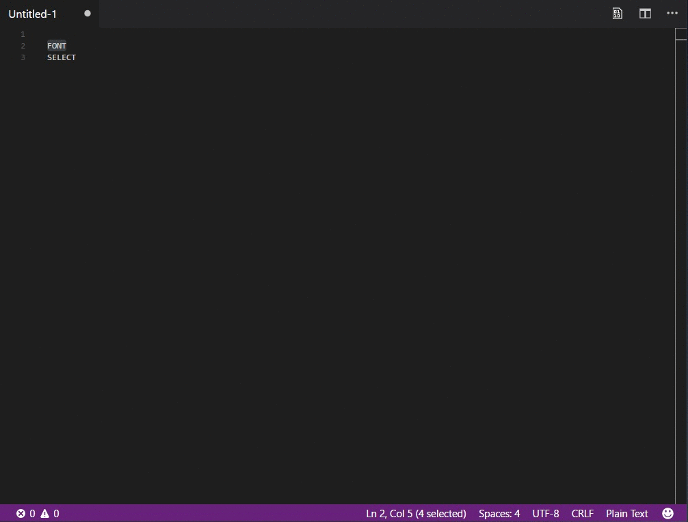
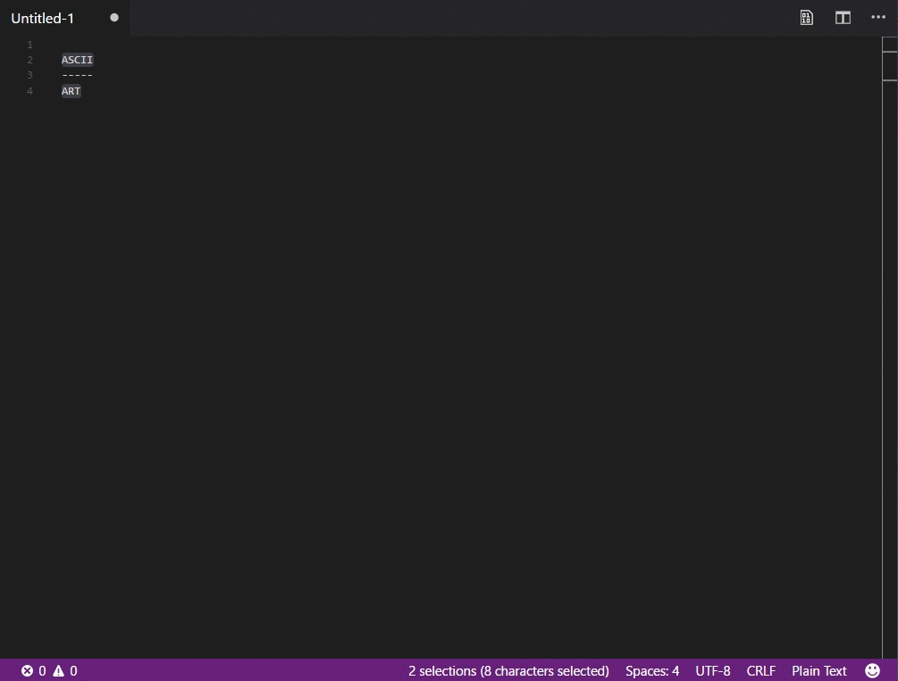
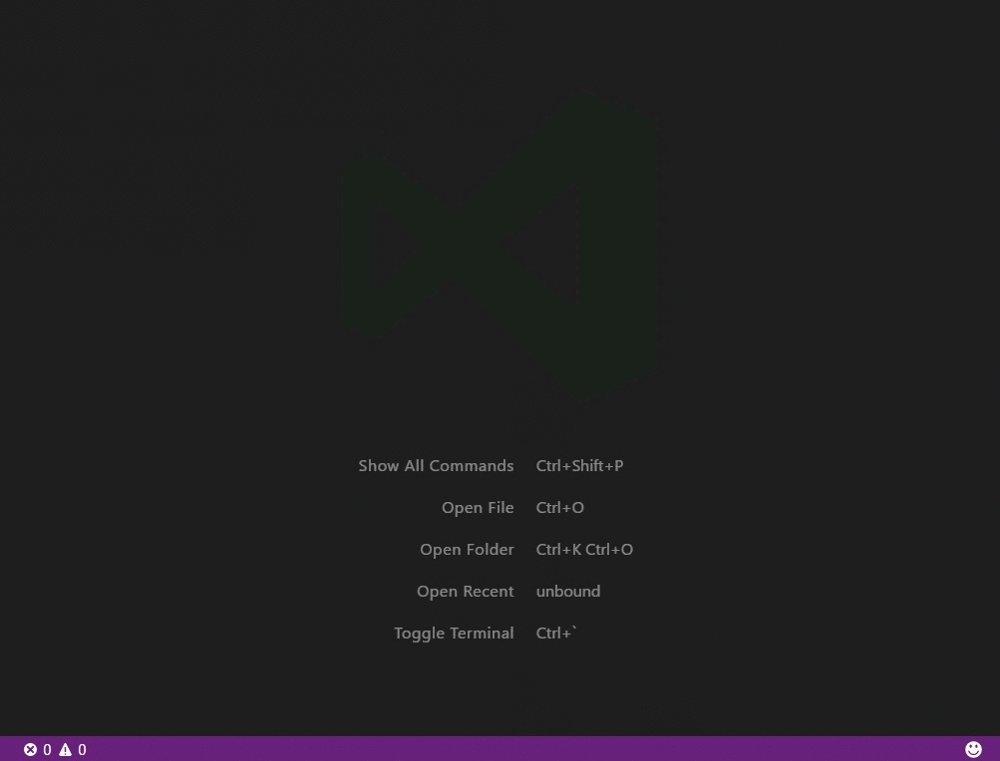

# ASCII Decorator

A VS Code extension that turns

```
text
```

to 

```
████████╗███████╗██╗  ██╗████████╗
╚══██╔══╝██╔════╝╚██╗██╔╝╚══██╔══╝
   ██║   █████╗   ╚███╔╝    ██║   
   ██║   ██╔══╝   ██╔██╗    ██║   
   ██║   ███████╗██╔╝ ██╗   ██║   
   ╚═╝   ╚══════╝╚═╝  ╚═╝   ╚═╝   
```

This is intended to be a VS Code port of [ASCII-Decorator for Sublime Text.](https://github.com/viisual/ASCII-Decorator)

## Features

### Font Selector



### Default Font



### Font Test



## Usage

### Command Palette

Bring up the command palette:

* <kbd>⇧⌘P</kbd> (*OSX*)
* <kbd>Ctrl + Shift + P</kbd> (*Windows/Linux*)

Type:

* `ASCII Decorator: Default Font`
* `ASCII Decorator: Font Selector`
* `ASCII Decorator: Generate Font Test (Selected Text)`
* `ASCII Decorator: Generate Font Test (Lorem Ipsum)`

## Extension Settings

* `asciidecorator.enable`: Enable/disable this extension.
* `asciidecorator.defaultFont`:  Default name of the font file to use.

## Updates

See [changelog](CHANGELOG.md).

## @TODO

- [x] Generate font test from all available fonts
- [X] Preview pane during selection
- [ ] Generate/select from font favorites
- [ ] Advanced settings

## References

* Features from Sublime extension: [viisual/asciidecorator](https://github.com/viisual/ASCII-Decorator)
* Implementation from: [Microsoft/VSMDTools](https://github.com/Microsoft/vscode-MDTools)
* Figlet.JS: [patorjk/figlet.js](https://github.com/patorjk/figlet.js)
